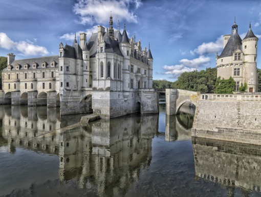
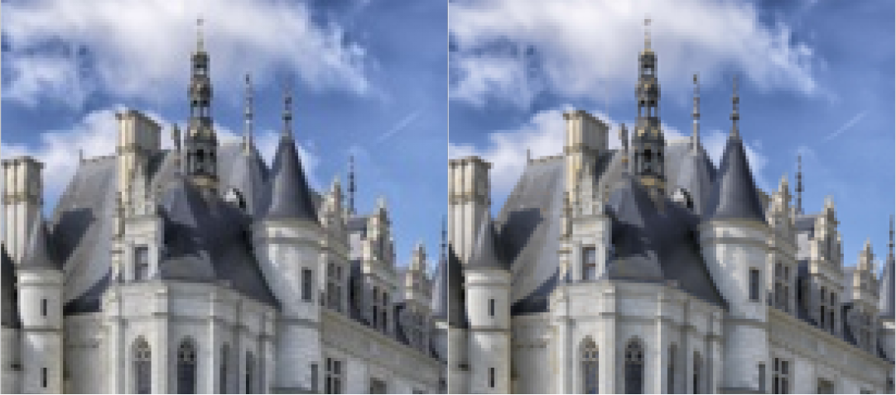
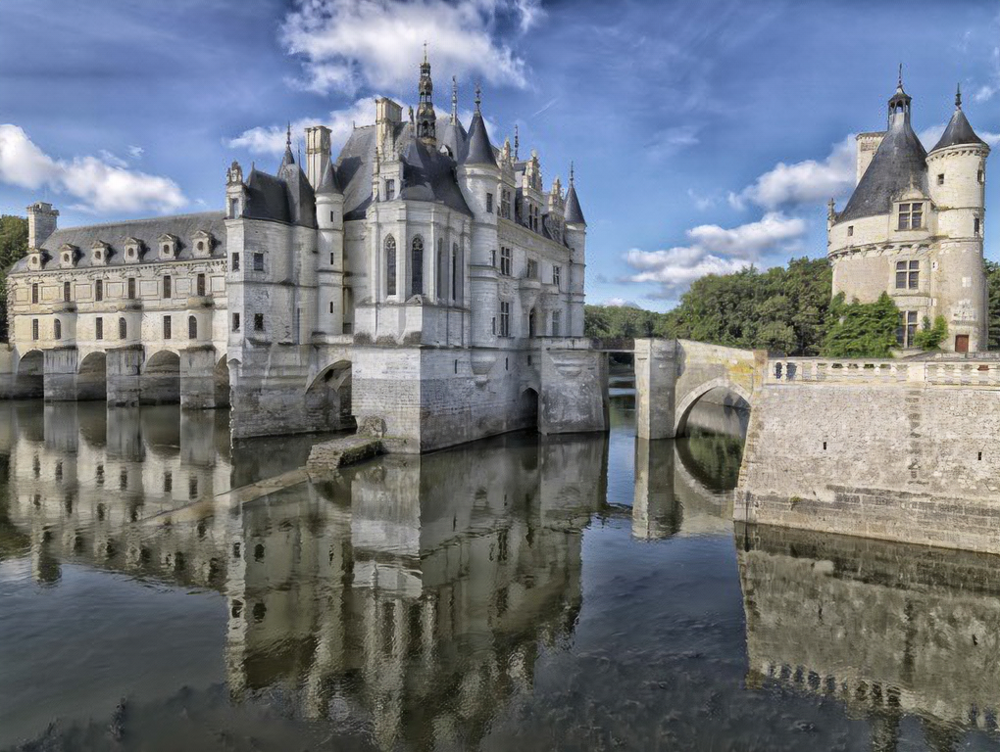
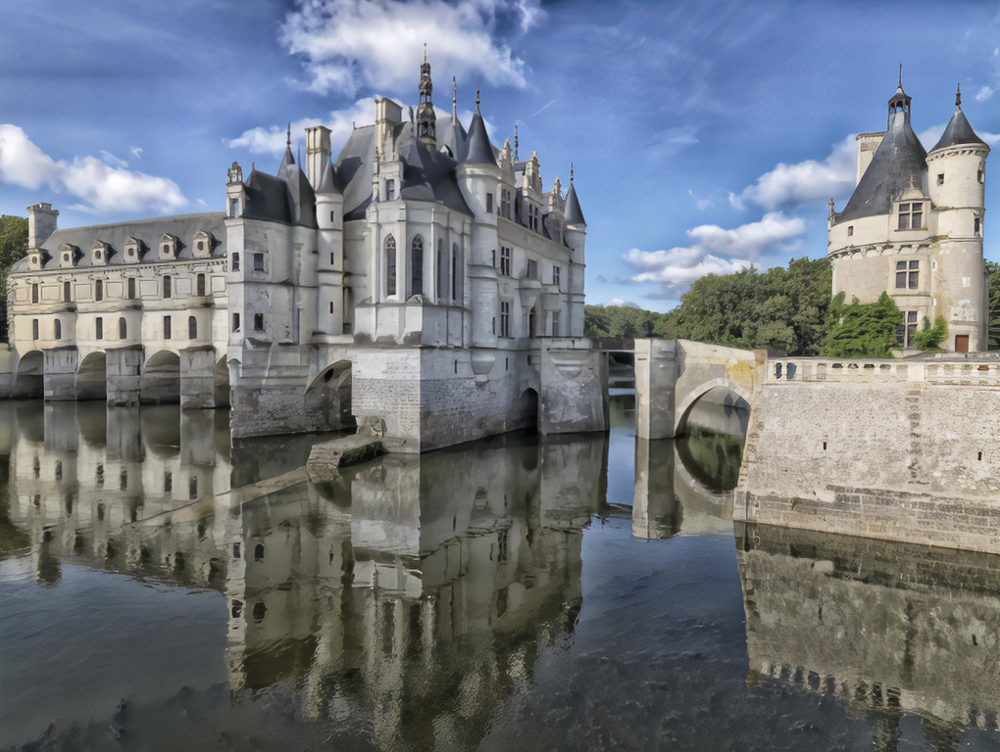
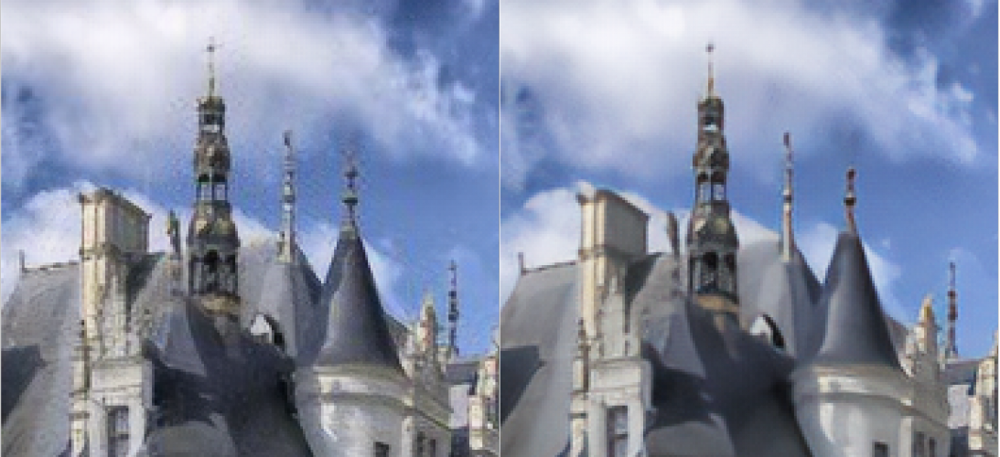
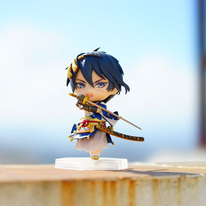
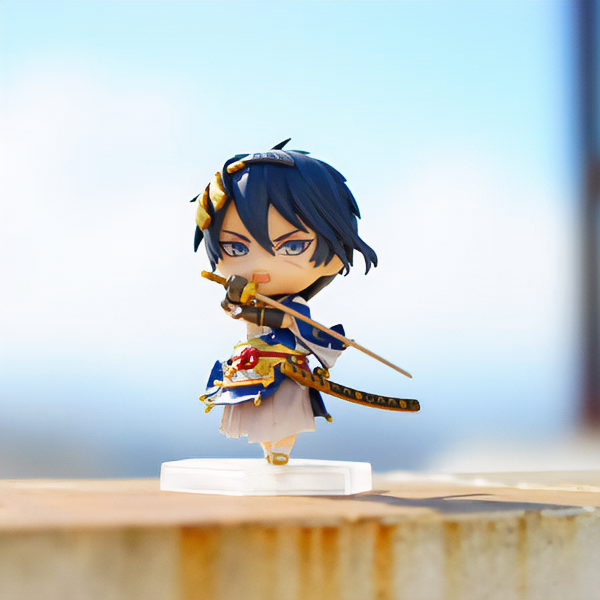

## SRGAN-with-Compresssion-Artifacts-Removal
Based SRGAN, this project removal Jepg image compression artifacts at the upscale process.
- Up-scale a low resolution jepg format image , and reduce Jepg compression artifacts at the same time.
- This code is super resolution based SRGAN, 2x and 4x upscale file was separated.

The original repo was forked from [@zsdonghao](https://github.com/tensorlayer/srgan) 's tensorlayer/srgan repo. I change the trained data form HR image and corresponding LR image to HR image and corresponding LR image which with jepg compression artifacts.

### Result
- LR image, a jepg image



Compared  to png source image, jpg image has so many compression artfacts. left is jpg, right is png.



- 2x upscale a jepg image use SRGAN



- 2x upscale a jepg image use my Compresssion-Artifacts-Removal model.



Compare  these two result detail. left is  use SRGAN, right is use my compresssion artifacts removal.



- LR image , a jepg image



- 2x upscale a jepg image use SRGAN


- 2x upscale a jepg image use my Compresssion-Artifacts-Removal model.



Compression artifacts arise in 2x SR images whenever a lossy compression algorithm is applied in jepg format LR image. But after I trained with HR image and  corresponding  LR image with jepg compression artifacts , most of artifacts has been removal.
It's also work in jepg LR image 4x-upscale.

### Prepare data and Pre-trained VGG
- Download the pretrained VGG19 model in [here](https://mega.nz/#!xZ8glS6J!MAnE91ND_WyfZ_8mvkuSa2YcA7q-1ehfSm-Q1fxOvvs) as [tutorial_vgg19.py](https://github.com/zsdonghao/tensorlayer/blob/master/example/tutorial_vgg19.py) show.
- Download high resolution images for training.
  I used images from DIV2K - bicubic downscaling x4 competition, you should change hyper-paremeters in config.py to your dataset path. LR image is downsample from HR image , and then add jepg compression artifacts .
### RUN
- set your training image dataset folder path in config.py
```python
config.TRAIN.hr_img_path = 'yourpath/DIV2K_train_HR/'
```
- Add jepg noise to LR image, by which create jepg compression artifacts images. It's the most important step.
```python
x = noise(x, 1, 0.5, 3)
```
- start to train
```bash
python main_2x.py  # for 2x upscale
python main_4x.py  # for 4x upscale
```
On this basis, I create a jepg noise reduction network, which can reduce jepg cpmoression noise whithout loss too much detail.

### Reference
* [1] [Photo-Realistic Single Image Super-Resolution Using a Generative Adversarial Network](https://arxiv.org/abs/1609.04802)

### Author
- [huangqianfirst](https://github.com/huangqianfirst)

### Citation
If you find this project useful, we would be grateful if you cite the TensorLayer paper：
```
article{tensorlayer2017,
author = {Dong, Hao and Supratak, Akara and Mai, Luo and Liu, Fangde and Oehmichen, Axel and Yu, Simiao and Guo, Yike},
journal = {ACM Multimedia},
title = {{TensorLayer: A Versatile Library for Efficient Deep Learning Development}},
url = {http://tensorlayer.org},
year = {2017}
}
```

